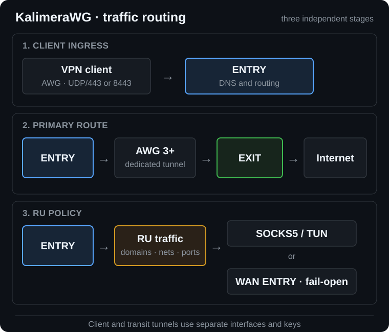

<p align="center">
  <a href="README.md">RU · Русский</a> ·
  <a href="README.en.md"><b>EN · English</b></a>
</p>

<p align="center">
  
</p>

<h1 align="center">KalimeraWG</h1>

<p align="center"><em><b>A managed AWG cascade: client → ENTRY → EXIT</b><br>
AmneziaWG 3+ · automatic PMTU/MTU · route-aware DNS · optional SOAX/SOCKS5</em></p>

<p align="center">
  <a href="https://github.com/FujitaKinzoku/KalimeraWG/releases/tag/v1.0.0"></a>
  
  
  
  <a href="LICENSE"></a>
</p>

KalimeraWG turns two clean Ubuntu 24.04 VPS instances into a reproducible
ENTRY/EXIT cascade, creates the first client, and installs operational tools.
Release `v1.0.0` has been verified through repeated clean VPS deployments.

## Quick start

| Requirement | Value |
|---|---|
| Servers | two clean Ubuntu 24.04 LTS VPS instances |
| ENTRY | accepts clients; public IPv4 required |
| EXIT | primary egress; public IPv4 required |
| Bootstrap access | root and working SSH on both servers; `kalimera` key access afterwards |
| Typical time | 20–40 minutes |

Run as `root` on ENTRY:

```bash
curl -fsSL https://raw.githubusercontent.com/FujitaKinzoku/KalimeraWG/v1.0.0/install.sh | bash
```

The command installs the immutable `v1.0.0` tag rather than the moving `main`
branch. Confirm the local version with `./deploy --version`.

## Architecture

<p align="center">
  
</p>

| Segment | Purpose | Default state |
|---|---|---|
| `awg0`, UDP/443 | modern clients | enabled |
| `awg-mobile`, UDP/8443 | iOS/mobile QUIC-like profile | enabled on first mobile peer |
| `awg-old` | KeeneticOS 4.3.x compatibility | enabled on first old peer |
| `awg3`, EXIT UDP/443 | independent userspace ENTRY–EXIT transit | enabled |

The public AWG3 port on EXIT is allowed only from the known ENTRY IPv4. Client
and transit segments use separate interfaces, keys, and parameters.

## Choose a profile

| Requirement | Recommended option |
|---|---|
| General-purpose cascade | `balanced` |
| Highest supported obfuscation | `masking` + AWG 3+ transit |
| Official AmneziaWG client on iOS | `mobile` on UDP/8443 |
| KeeneticOS 4.3.x | `old` on the compatibility interface |
| Highest client performance | `performance` |
| Russian residential/mobile egress | SOAX or another SOCKS5 provider |

### Validated compatibility

| Path | `v1.0.0` validation |
|---|---|
| Ubuntu 24.04 LTS | repeated clean deployments across different VPS providers, reboot, and strict audit |
| ENTRY–EXIT | fresh AWG 3+ handshake, coordinated MTU, and post-reboot recovery |
| iOS | `mobile` profile on the dedicated UDP/8443 interface in the official AmneziaWG client |
| KeeneticOS | `balanced` and `old` profiles for current and compatibility firmware branches |
| RU SOCKS5 | TCP/UDP probing, watchdog, fail-open through ENTRY, and automatic recovery |

This matrix records scenarios that were actually exercised. It cannot guarantee
identical behavior across every carrier, hosting provider, and client version.

```bash
vpn-user phone balanced
vpn-user iphone mobile
vpn-user list
vpn-user delete phone
```

## Routing and DNS

| Policy | Route | DNS transport |
|---|---|---|
| default and `se-domain` | ENTRY → AWG3 → EXIT | Unbound → DoT |
| `entry-domain` | ENTRY WAN | managed local resolver |
| RU networks and `ru-domain` | ENTRY WAN or SOCKS5/TUN | DoH through the RU proxy when available |
| SOCKS5 outage | automatic fail-open through ENTRY | default DoT remains available |

Client DNS is redirected to the local ENTRY resolver. Runtime policy uses
`ipset`, `iptables`, packet marks, and dedicated routing tables.

## Reliability

| Mechanism | Purpose |
|---|---|
| bidirectional PMTU | coordinated MTU without avoidable fragmentation |
| TCP MSS clamp | reliable TCP inside the cascade |
| kernel/DKMS guard | prevents reboot into a kernel without AmneziaWG |
| transactional component updates | validated ENTRY/EXIT update with rollback |
| bounded DNS/APT/SSH/AWG3 retries | tolerates transient provider failures |
| SOCKS5 watchdog | stateful fail-open and recovery |
| health/audit gates | detect service, firewall, DNS, and routing drift |

## Security in v1.0.0

| Boundary | Implementation |
|---|---|
| Secrets | Ansible Vault, `no_log`, mode `0600`, no client configs in Git/CI |
| SSH | dedicated `kalimera` account; key access is verified before old ports close; Fail2Ban follows |
| Privileges | project commands use a root-owned allowlist; unrestricted sudo still requires the user password |
| Passwords | four independent 30-character values are shown once; only hashes remain in Vault |
| Firewall | deny-by-default UFW; AWG3 limited to known ENTRY/EXIT IPv4 peers |
| Updates | candidate validation, exact applied-version lock, automatic rollback |
| Kernel | headers, DKMS and `modinfo` verified for the running and newest installed kernels |
| DNS | local Unbound, validated DoT/DoH, provider-DNS failure resilience |
| No-logs | journal and login accounting stay in RAM; UFW/sing-box/DNS query logs, shell history, and coredumps are disabled |
| AWG3 failures | bounded retries and sanitized diagnostics without key material |
| Repository | Gitleaks plus YAML, Ansible, Shell, and Python checks |

See [SECURITY.md](SECURITY.md) and
[docs/security-boundary.md](docs/security-boundary.md) for the threat model.

## Operations

| Area | Commands |
|---|---|
| State | `kalimera-status`, `awg-health --strict`, `server-audit` |
| Clients | `vpn-user`, `awg-mobile`, `awg-old` |
| DNS | `dns-status`, `dot-switch`, `doh-switch` |
| Routing | `ru-domain`, `se-domain`, `entry-domain`, `ru-direct-ports` |
| Proxy | `ru-proxy`, `ru-proxy-set` |
| Maintenance | `maintenance`, `update-all`, `kalimera-deploy --resume` |

Normal post-installation administration uses the `kalimera` account. Project
commands do not require typing `sudo`; arbitrary system changes still require
the one-time displayed `kalimera` password, so no unrestricted passwordless
root shell is created.

Validation on both nodes:

```bash
awg-health --strict
server-audit
systemctl --failed --no-pager
```

## Documentation

| Document | Content |
|---|---|
| [docs/interactive-deploy.md](docs/interactive-deploy.md) | installation flow |
| [docs/awg3.md](docs/awg3.md) | AWG 3+ transit |
| [docs/security-boundary.md](docs/security-boundary.md) | secrets, UFW and trust boundaries |
| [docs/acceptance.md](docs/acceptance.md) | acceptance checks |
| [docs/upstream.md](docs/upstream.md) | pinned upstream components |
| [CHANGELOG.md](CHANGELOG.md) | release history |

## Scope

KalimeraWG does not guarantee anonymity, IP reputation, third-party proxy
availability, or access through every network. It does not make cleartext
traffic beyond the VPN exit end-to-end encrypted. Users remain responsible for
lawful use and provider terms.

KalimeraWG is not an official Amnezia VPN project. Third-party notices are in
[THIRD_PARTY_NOTICES.md](THIRD_PARTY_NOTICES.md).

<p align="center"><b>KalimeraWG v1.0.0 · two servers, one managed route</b></p>
