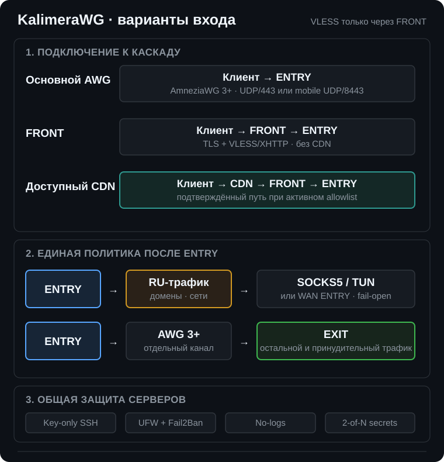
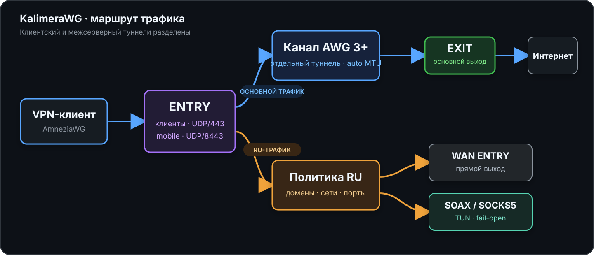

<p align="center">
  <a href="README.md"><b>RU · Русский</b></a> ·
  <a href="README.en.md">EN · English</a>
</p>

<p align="center">
  
</p>

<h1 align="center">KalimeraWG</h1>

<p align="center"><em><b>Управляемый AWG-каскад: клиент → ENTRY → EXIT</b><br>
AmneziaWG 3+ · VLESS+REALITY · CDN/XHTTP · маршрутный DNS · SOAX/SOCKS5</em></p>

<p align="center">
  <a href="https://github.com/FujitaKinzoku/KalimeraWG/releases/tag/v2.1.0"></a>
  
  
  
  <a href="LICENSE"></a>
  <a href="https://github.com/FujitaKinzoku/KalimeraWG/actions"></a>
</p>

KalimeraWG превращает две чистые VPS с Ubuntu 24.04 в воспроизводимый каскад,
создаёт первого VPN-клиента и устанавливает инструменты эксплуатации. В
тестовой ветке можно добавить третью роль FRONT для VLESS/XHTTP. Выпуск
`v2.1.0` проверен повторными чистыми установками на разных VPS.

> **v2.0.0 - крупный релиз усиления безопасности.** Переработана модель
> доступа (отдельный администратор `kalimera` вместо повседневного root),
> добавлена пороговая защита секретов на диске, ужесточены SSH и политика
> хранения логов, устранены гонки каскада при загрузке. Подробности - в
> разделе [Что нового в v2.0.0](#что-нового-в-v200) и в
> [CHANGELOG.md](CHANGELOG.md).

## Быстрый старт

| Требование | Значение |
|---|---|
| Серверы | две чистые VPS с Ubuntu 24.04 LTS |
| ENTRY | принимает клиентов; требуется публичный IPv4 |
| EXIT | выпускает основной трафик; требуется публичный IPv4 |
| Начальный доступ | root и работающий SSH на обоих серверах; после установки - `kalimera` по ключу |
| Время | обычно 20–40 минут |

Запустите на ENTRY от `root`:

```bash
curl -fsSL https://raw.githubusercontent.com/FujitaKinzoku/KalimeraWG/v2.1.0/install.sh | bash
```

Команда загружает и устанавливает именно выпуск `v2.1.0`, а не изменяемое
состояние ветки `main`. Проверить версию локальной копии:

```bash
cd /root/KalimeraWG
./deploy --version
```

<details>
<summary><b>Установка с предварительным просмотром через Git</b></summary>

```bash
apt-get -o DPkg::Lock::Timeout=600 update
apt-get -o DPkg::Lock::Timeout=600 install -y git
git clone --branch v2.1.0 --depth 1 \
  https://github.com/FujitaKinzoku/KalimeraWG.git /root/KalimeraWG
cd /root/KalimeraWG
./deploy
```

</details>

Установщик запросит адреса и SSH-порты серверов, административный публичный
SSH-ключ, режим RU-маршрута, DNS, необязательные SOCKS5 и Telegram, а затем
создаст конфигурацию первого клиента. Закрытый SSH-ключ вводить нельзя.

## Подтверждённый тестовый этап: работа при белых списках

> **Статус на 23 августа 2026 года.** Ветка
> `feature/vless-reality-fallback` прошла полевую проверку: новая клиентская
> сессия установилась при активном режиме белых списков по цепочке
> **совместимый облачный CDN → FRONT → ENTRY**, после чего сохранились штатные
> маршруты RU/EXIT. Это фиксация результата теста, а не новый стабильный
> релиз и не гарантия одинаковой доступности у всех операторов.

<p align="center">
  <picture>
    <source media="(max-width: 600px)" srcset="assets/whitelist-cascade-ru-mobile.svg">
    
  </picture>
</p>

Основной AWG идёт прямо на ENTRY. VLESS всегда завершается на FRONT: клиент
подключается к origin-домену напрямую либо к доступному CDN edge. Затем FRONT
открывает служебный REALITY-хоп к отдельному backend ENTRY.

| Путь клиента | Транспорт | Назначение | Статус этапа |
|---|---|---|---|
| клиент → ENTRY | AmneziaWG 3+, UDP/443 или mobile UDP/8443 | основной путь с минимальными накладными расходами | проверен ранее |
| клиент → FRONT | TLS + VLESS/XHTTP, TCP/443 | прямой VLESS без CDN; публичного VLESS на ENTRY нет | реализован в тестовой ветке |
| клиент → CDN → FRONT | TLS + VLESS/XHTTP, TCP/443 | вход при доступном CDN во время IP allowlist | подтверждён полевым тестом |
| FRONT → ENTRY | VLESS+REALITY | скрывает origin ENTRY от клиента CDN-пути | подтверждён полевым тестом |
| ENTRY → EXIT | отдельный AWG 3+ | основной и принудительный `se-domain` egress | без изменений |
| ENTRY → RU | SOCKS5/TUN либо fail-open через WAN ENTRY | российские домены и сети | без изменений |

### Что именно подтвердил тест

| Проверка | Результат |
|---|---|
| запуск новой сессии во время ограничения | соединение установлено через CDN, без прямого обращения клиента к IP ENTRY |
| доставка до FRONT | реальный TLS на клиентском домене и XHTTP прошли CDN |
| внутренний хоп | FRONT подключился к отдельной службе `kalimera-front-backend` на ENTRY |
| политика после входа | RU-трафик сохранил SOCKS5/fail-open, остальной трафик - EXIT через AWG 3+ |
| существующие профили | AWG/mobile/old не заменены и продолжают использовать прежние интерфейсы |

Результат относится к проверенной сети, региону, CDN edge и моменту времени.
Оператор может менять IP/SNI/HTTP-политику без уведомления, поэтому FRONT -
аварийный путь, а не обещание универсального обхода. Технология, настройки CDN,
матрица отказов и границы проверки подробно описаны в
[docs/front-relay.md](docs/front-relay.md).

## Что нового в v2.0.0

Релиз `v2.0.0` - пакет усиления безопасности поверх `v1.0.0`: без изменения
портов, MTU, DNS-политик и маршрутов каскада. Основные изменения:

| Область | Было в v1.0.0 | Стало в v2.0.0 |
|---|---|---|
| Администрирование | повседневная работа под `root` по SSH-ключу | отдельный пользователь `kalimera`; `root` SSH ограничен адресом автоматизации |
| Пароли | единый пароль `root` | 4 независимых 30-символьных пароля `kalimera`/`root` на ENTRY и EXIT; показываются один раз, в Vault - только SHA-512-хеши |
| Секреты на диске | обычные файлы конфигурации AWG/AWG3/sing-box | пороговая защита Shamir `2-of-5` + AES-256-GCM; открытые данные только в `/run`, конфиги передаются через systemd credentials |
| Загрузка каскада | службы стартуют сразу | fail-closed старт: ожидание кворума долей, проверка закреплённых SSH host keys, отказ при изменённом пакете |
| SSH | key-only доступ, Fail2Ban | дополнительно: скрытый banner, запрет пользовательских startup-файлов, адресное ограничение ключа автоматизации, отдельный резервный административный ключ |
| Хранение логов | стандартный journald и Fail2Ban | политика no-logs: journald/Fail2Ban/учёт входов только в RAM; UFW/sing-box/DNS query logs, shell history и coredump отключены |
| Аудит | `server-audit` | добавлен `ssh-key-audit` (посторонние ключи root) и расширенный `server-audit` (публичные listener'ы, соответствие no-logs политике) |
| Надёжность каскада | - | устранены гонки маршрутизации и AWG3 при загрузке, добавлено самовосстановление маршрута EXIT, устранены ложные срабатывания health-check после перезагрузки |
| Ядро/DKMS | проверка `/vmlinuz` | guard распознаёт все установленные ядра, включая signed/unsigned kernel-пакеты |

Полный список изменений - в [CHANGELOG.md](CHANGELOG.md) (раздел `[2.0.0]`).
Модель угроз и границы доверия для новых механизмов - в
[docs/RUNTIME-SECRETS.md](docs/RUNTIME-SECRETS.md) и
[docs/security-boundary.md](docs/security-boundary.md).

## Как устроен каскад

<p align="center">
  <picture>
    <source media="(max-width: 600px)" srcset="assets/cascade-ru-mobile.svg">
    
  </picture>
</p>

| Сегмент | Назначение | Состояние по умолчанию |
|---|---|---|
| `awg0`, UDP/443 | современные клиенты | включён |
| `awg-mobile`, UDP/8443 | iOS/mobile QUIC-подобный профиль | включается при первом mobile-клиенте |
| `awg-old` | совместимость с KeeneticOS 4.3.x | включается при первом old-клиенте |
| `awg3`, EXIT UDP/443 | отдельный userspace-канал ENTRY–EXIT | включён |

Межсерверный порт EXIT разрешён UFW только для известного публичного IPv4
ENTRY. Клиентский и межсерверный каналы используют разные интерфейсы, ключи и
параметры.

## Выберите сценарий

| Задача | Рекомендуемый вариант |
|---|---|
| Обычный надёжный каскад | профиль `balanced`, RU напрямую через ENTRY |
| Максимальная доступная маскировка | профиль `masking` + межсерверный AWG 3+ |
| Официальный клиент AmneziaWG на iOS | профиль `mobile`, отдельный UDP/8443 |
| KeeneticOS 4.3.x | профиль `old`, отдельный совместимый интерфейс |
| Российский residential/mobile IP | SOAX или другой SOCKS5 |
| Максимальная скорость клиента | профиль `performance` |
| Уведомления об отказах | Telegram-мониторинг |
| AmneziaWG заблокирован по фингерпринту UDP | VLESS/XHTTP через FRONT без CDN |
| Режим белых списков на проверенной мобильной сети | подтверждённый резерв FRONT через совместимый облачный CDN, [docs/front-relay.md](docs/front-relay.md) |

## Маршрутизация и DNS

| Политика | Маршрут | DNS-транспорт |
|---|---|---|
| обычный трафик и `se-domain` | ENTRY → AWG3 → EXIT | Unbound → DoT |
| `entry-domain` | напрямую через ENTRY | управляемый локальный резолвер |
| RU-сети и `ru-domain` | ENTRY WAN либо SOCKS5/TUN | DoH через RU-прокси при его работе |
| отказ SOCKS5 | автоматический fail-open через ENTRY | основной DoT без потери DNS |

DNS клиентов принудительно направляется на локальный резолвер ENTRY. Политику
реализуют `ipset`, `iptables`, пакетные метки и отдельные таблицы маршрутизации.
Настройки применяются сразу и сохраняются после повторного deploy.

```bash
ru-domain add example.ru
se-domain add example.com
entry-domain add example.org
ru-direct-ports add 993
```

## Клиентские профили

| Профиль | Для чего | Интерфейс |
|---|---|---|
| `performance` | минимальные накладные расходы | `awg0` |
| `balanced` | рекомендуемый универсальный вариант | `awg0` |
| `masking` | максимальный набор поддерживаемых параметров | `awg0` |
| `mobile` | проверенный iOS/QUIC-подобный профиль | `awg-mobile` |
| `old` | старые версии KeeneticOS | `awg-old` |

### Проверенная совместимость

| Контур | Проверка выпуска `v2.1.0` |
|---|---|
| Ubuntu 24.04 LTS | повторные чистые установки на VPS разных провайдеров, перезагрузка и строгий аудит |
| ENTRY–EXIT | свежий AWG 3+ handshake, согласованный MTU и восстановление после перезагрузки |
| iOS | профиль `mobile` через отдельный интерфейс UDP/8443 в официальном клиенте AmneziaWG |
| KeeneticOS | профили `balanced` и `old` для актуальных и совместимых веток прошивки |
| RU SOCKS5 | проверка TCP/UDP, watchdog, fail-open через ENTRY и автоматическое восстановление |
| Белые списки | в тестовой ветке подтверждена новая сессия через совместимый облачный CDN → FRONT → ENTRY с сохранением RU/EXIT-маршрутов |

Матрица фиксирует реально пройденные сценарии, но не гарантирует одинаковое
поведение у всех операторов, хостингов и версий клиентского ПО.

```bash
vpn-user phone balanced
vpn-user iphone mobile
vpn-user list
vpn-user delete phone
```

`vpn-user list` не печатает ключи. Удаление немедленно отзывает локально
созданный peer и сохраняет root-only резервную копию.

## Автоматизация и надёжность

| Механизм | Что он предотвращает |
|---|---|
| двусторонний PMTU | фрагментацию и несогласованный MTU сегментов |
| MSS clamp | проблемы TCP внутри каскада |
| проверка DKMS до перезагрузки | загрузку ядра без модуля AmneziaWG |
| транзакционное обновление компонентов | частично применённые обновления ENTRY/EXIT |
| повторные попытки DNS/APT/SSH/AWG3 | ложные отказы из-за кратковременной недоступности |
| SOCKS5 watchdog | зависший RU-маршрут без рабочего прокси |
| `awg-health` и `server-audit` | незаметный дрейф служб, UFW, DNS и маршрутов |
| Telegram | отсутствие уведомлений о перезагрузке, отказе и восстановлении |

## Безопасность v2.1.0

В `v2.0.0`–`v2.1.0` усилены следующие границы:

| Область | Реализация |
|---|---|
| Секреты | Ansible Vault, `no_log`, права `0600`, отсутствие клиентских конфигов в Git/CI |
| SSH | отдельный `kalimera`, key-only доступ, проверка до закрытия старого порта и Fail2Ban |
| Привилегии | команды проекта без явного `sudo` через ограниченный allowlist; полный sudo требует пароль |
| Пароли | четыре независимых 30-символьных значения показываются один раз; сохраняются только хеши в Vault |
| Firewall | запрещающие политики UFW; AWG3 разрешён только между известными IPv4 ENTRY/EXIT |
| Обновления | проверка кандидатов, фиксация применённых версий и автоматический rollback |
| Ядро | заголовки, DKMS и `modinfo` проверяются для текущего и наиболее нового установленного ядра |
| DNS | локальный Unbound, контроль DoT/DoH, защита от DNS-сбоев образа VPS; `/etc/resolv.conf` и `nsswitch.conf` принудительно приводятся к `systemd-resolved` независимо от провайдера (v2.0.1); опционально - дефолтная ветка резолвится через собственную DNSSEC-рекурсию на EXIT внутри AWG-туннеля вместо внешнего DoT, без утечки отдельного TLS ClientHello с ENTRY (v2.1.0) |
| No-logs | journal и учёт входов только в RAM; UFW/sing-box/DNS query logs, shell history и coredump отключены |
| Секреты на диске | Shamir 2-of-5 + AES-256-GCM; открытые конфигурации только в `/run`, службы используют systemd credentials |
| Ошибки AWG3 | ограниченные повторные попытки и очищенная диагностика без ключевого материала |
| Сеть VPS | совместимость с ifupdown/systemd-networkd без самовольной смены сетевого менеджера |
| Репозиторий | Gitleaks, собственный secret scan, YAML/Ansible/Shell/Python-проверки в CI |

Подробная модель угроз и правила сообщения об уязвимости:
[SECURITY.md](SECURITY.md) и [docs/security-boundary.md](docs/security-boundary.md).

## Основные команды

| Раздел | Команды |
|---|---|
| Состояние | `kalimera-status`, `awg-health --strict`, `server-audit` |
| Клиенты | `vpn-user`, `awg-mobile`, `awg-old` |
| DNS | `dns-status`, `dot-switch`, `doh-switch` |
| Домены | `ru-domain`, `se-domain`, `entry-domain` |
| RU-прокси | `ru-proxy`, `ru-proxy-set`, `ru-direct-ports` |
| REALITY | `reality-dest-switch status\|list`; смена dest управляемого FRONT выполняется через inventory и deploy |
| FRONT-релей | `./deploy --resume --enable-front`, затем `kalimera-test`; [docs/front-relay.md](docs/front-relay.md) |
| VLESS-пользователи | на FRONT: `vless-user create ИМЯ cdn`, `list`, `export`, `delete` |
| Замена FRONT | `kalimera-deploy --resume --replace-front`, затем `--commit-front-replacement` |
| Безопасность | `fail2ban-client status sshd`, `f2b-reset`, `ssh-key-audit status`, `telegram-test` |
| Обслуживание | `maintenance`, `update-all`, `kalimera-deploy --resume` |

При новом SSH-входе ENTRY, EXIT и FRONT показывают адаптивную таблицу с
фактическими endpoint, режимами, маршрутами и состоянием защиты. Полная справка:
`kalimera-help`.

После завершения установки обычная работа выполняется под `kalimera`. Команды
из таблицы запускаются без написания `sudo` и без запроса пароля. Произвольные
системные изменения через полный `sudo` требуют одноразово показанный пароль
`kalimera`; постоянный passwordless root shell намеренно не создаётся.

## Проверка установки

На обоих серверах:

```bash
awg-health --strict
server-audit
systemctl --failed --no-pager
```

Успешный результат: `GOOD`, `Ошибок аудита: 0` и отсутствие failed units.
При ошибке запуска AWG3 установщик автоматически выводит очищенный отчёт
systemd, интерфейса и порта, не раскрывая конфигурацию и ключи.

## Обновление

Повторный deploy текущего выпуска:

```bash
cd /root/KalimeraWG
./deploy --resume
```

Перед переходом на будущий выпуск прочитайте его release notes и `CHANGELOG.md`.
KalimeraWG не переключает установленный сервер на изменяемую ветку `main`
автоматически.

## Документация

| Документ | Содержание |
|---|---|
| [docs/interactive-deploy.md](docs/interactive-deploy.md) | этапы интерактивной установки |
| [docs/awg3.md](docs/awg3.md) | межсерверный AWG 3+ и параметры |
| [docs/security-boundary.md](docs/security-boundary.md) | секреты, UFW и границы доверия |
| [docs/terminal.md](docs/terminal.md) | интерфейс терминала и справка |
| [docs/acceptance.md](docs/acceptance.md) | приёмочная проверка |
| [docs/front-relay.md](docs/front-relay.md) | подтверждённая CDN/FRONT-схема для режима белых списков и её ограничения |
| [docs/upstream.md](docs/upstream.md) | закреплённые upstream-компоненты |
| [CHANGELOG.md](CHANGELOG.md) | история выпусков |

## Ограничения и ответственное использование

Проект не гарантирует анонимность, репутацию IP, доступность внешнего прокси или
отсутствие блокировок. Он не превращает незашифрованный протокол после выхода
из VPN в end-to-end шифрование. Пользователь отвечает за законность применения,
правила хостинга, прокси-провайдера и сетей, к которым подключается.

KalimeraWG не является официальным проектом Amnezia VPN. Сторонние компоненты и
лицензии перечислены в [THIRD_PARTY_NOTICES.md](THIRD_PARTY_NOTICES.md).

<p align="center"><b>KalimeraWG v2.1.0 · два сервера, один управляемый маршрут</b></p>
