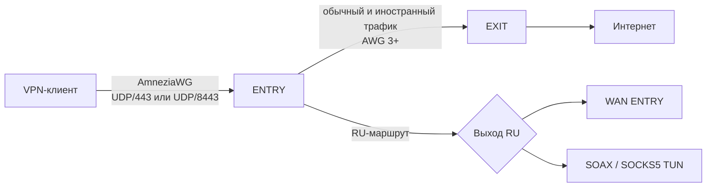

<p align="center">
  <a href="README.md"><b>RU · Русский</b></a> ·
  <a href="README.en.md">EN · English</a>
</p>

<p align="center">
  
</p>

<h1 align="center">KalimeraWG</h1>

<p align="center"><em><b>Управляемый AWG-каскад: клиент → ENTRY → EXIT</b><br>
AmneziaWG 3+ · автоматический PMTU/MTU · маршрутный DNS · SOAX/SOCKS5</em></p>

<p align="center">
  <a href="https://github.com/FujitaKinzoku/KalimeraWG/releases/tag/v1.0.0"></a>
  
  
  
  <a href="LICENSE"></a>
  <a href="https://github.com/FujitaKinzoku/KalimeraWG/actions"></a>
</p>

KalimeraWG превращает две чистые VPS с Ubuntu 24.04 в воспроизводимый каскад,
создаёт первого VPN-клиента и устанавливает инструменты эксплуатации. Выпуск
`v1.0.0` проверен повторными чистыми установками на разных VPS.

## Быстрый старт

| Требование | Значение |
|---|---|
| Серверы | две чистые VPS с Ubuntu 24.04 LTS |
| ENTRY | принимает клиентов; требуется публичный IPv4 |
| EXIT | выпускает основной трафик; требуется публичный IPv4 |
| Доступ | root и работающий SSH на обоих серверах |
| Время | обычно 20–40 минут |

Запустите на ENTRY от `root`:

```bash
curl -fsSL https://raw.githubusercontent.com/FujitaKinzoku/KalimeraWG/v1.0.0/install.sh | bash
```

Команда загружает и устанавливает именно выпуск `v1.0.0`, а не изменяемое
состояние ветки `main`. Проверить версию локальной копии:

```bash
cd /root/KalimeraWG
./deploy --version
```

<details>
<summary><b>Установка с предварительным просмотром через Git</b></summary>

```bash
apt-get -o DPkg::Lock::Timeout=600 update
apt-get -o DPkg::Lock::Timeout=600 install -y git
git clone --branch v1.0.0 --depth 1 \
  https://github.com/FujitaKinzoku/KalimeraWG.git /root/KalimeraWG
cd /root/KalimeraWG
./deploy
```

</details>

Установщик запросит адреса и SSH-порты серверов, административный публичный
SSH-ключ, режим RU-маршрута, DNS, необязательные SOCKS5 и Telegram, а затем
создаст конфигурацию первого клиента. Закрытый SSH-ключ вводить нельзя.

## Как устроен каскад



| Сегмент | Назначение | Состояние по умолчанию |
|---|---|---|
| `awg0`, UDP/443 | современные клиенты | включён |
| `awg-mobile`, UDP/8443 | iOS/mobile QUIC-подобный профиль | включается при первом mobile-клиенте |
| `awg-old` | совместимость с KeeneticOS 4.3.x | включается при первом old-клиенте |
| `awg3`, EXIT UDP/443 | отдельный userspace-канал ENTRY–EXIT | включён |

Межсерверный порт EXIT разрешён UFW только для известного публичного IPv4
ENTRY. Клиентский и межсерверный каналы используют разные интерфейсы, ключи и
параметры.

## Выберите сценарий

| Задача | Рекомендуемый вариант |
|---|---|
| Обычный надёжный каскад | профиль `balanced`, RU напрямую через ENTRY |
| Максимальная доступная маскировка | профиль `masking` + межсерверный AWG 3+ |
| Официальный клиент AmneziaWG на iOS | профиль `mobile`, отдельный UDP/8443 |
| KeeneticOS 4.3.x | профиль `old`, отдельный совместимый интерфейс |
| Российский residential/mobile IP | SOAX или другой SOCKS5 |
| Максимальная скорость клиента | профиль `performance` |
| Уведомления об отказах | Telegram-мониторинг |

## Маршрутизация и DNS

| Политика | Маршрут | DNS-транспорт |
|---|---|---|
| обычный трафик и `se-domain` | ENTRY → AWG3 → EXIT | Unbound → DoT |
| `entry-domain` | напрямую через ENTRY | управляемый локальный резолвер |
| RU-сети и `ru-domain` | ENTRY WAN либо SOCKS5/TUN | DoH через RU-прокси при его работе |
| отказ SOCKS5 | автоматический fail-open через ENTRY | основной DoT без потери DNS |

DNS клиентов принудительно направляется на локальный резолвер ENTRY. Политику
реализуют `ipset`, `iptables`, пакетные метки и отдельные таблицы маршрутизации.
Настройки применяются сразу и сохраняются после повторного deploy.

```bash
ru-domain add example.ru
se-domain add example.com
entry-domain add example.org
ru-direct-ports add 993
```

## Клиентские профили

| Профиль | Для чего | Интерфейс |
|---|---|---|
| `performance` | минимальные накладные расходы | `awg0` |
| `balanced` | рекомендуемый универсальный вариант | `awg0` |
| `masking` | максимальный набор поддерживаемых параметров | `awg0` |
| `mobile` | проверенный iOS/QUIC-подобный профиль | `awg-mobile` |
| `old` | старые версии KeeneticOS | `awg-old` |

```bash
vpn-user phone balanced
vpn-user iphone mobile
vpn-user list
vpn-user delete phone
```

`vpn-user list` не печатает ключи. Удаление немедленно отзывает локально
созданный peer и сохраняет root-only резервную копию.

## Автоматизация и надёжность

| Механизм | Что он предотвращает |
|---|---|
| двусторонний PMTU | фрагментацию и несогласованный MTU сегментов |
| MSS clamp | проблемы TCP внутри каскада |
| проверка DKMS до перезагрузки | загрузку ядра без модуля AmneziaWG |
| транзакционное обновление компонентов | частично применённые обновления ENTRY/EXIT |
| повторные попытки DNS/APT/SSH/AWG3 | ложные отказы из-за кратковременной недоступности |
| SOCKS5 watchdog | зависший RU-маршрут без рабочего прокси |
| `awg-health` и `server-audit` | незаметный дрейф служб, UFW, DNS и маршрутов |
| Telegram | отсутствие уведомлений о перезагрузке, отказе и восстановлении |

## Безопасность v1.0.0

В первом стабильном выпуске усилены следующие границы:

| Область | Реализация |
|---|---|
| Секреты | Ansible Vault, `no_log`, права `0600`, отсутствие клиентских конфигов в Git/CI |
| SSH | проверка нового key-only доступа до закрытия старого порта; затем Fail2Ban |
| Firewall | запрещающие политики UFW; AWG3 разрешён только между известными IPv4 ENTRY/EXIT |
| Обновления | проверка кандидатов, фиксация применённых версий и автоматический rollback |
| Ядро | заголовки, DKMS и `modinfo` проверяются для текущего и следующего ядра |
| DNS | локальный Unbound, контроль DoT/DoH, защита от DNS-сбоев образа VPS |
| Ошибки AWG3 | ограниченные повторные попытки и очищенная диагностика без ключевого материала |
| Сеть VPS | совместимость с ifupdown/systemd-networkd без самовольной смены сетевого менеджера |
| Репозиторий | Gitleaks, собственный secret scan, YAML/Ansible/Shell/Python-проверки в CI |

Подробная модель угроз и правила сообщения об уязвимости:
[SECURITY.md](SECURITY.md) и [docs/security-boundary.md](docs/security-boundary.md).

## Основные команды

| Раздел | Команды |
|---|---|
| Состояние | `kalimera-status`, `awg-health --strict`, `server-audit` |
| Клиенты | `vpn-user`, `awg-mobile`, `awg-old` |
| DNS | `dns-status`, `dot-switch`, `doh-switch` |
| Домены | `ru-domain`, `se-domain`, `entry-domain` |
| RU-прокси | `ru-proxy`, `ru-proxy-set`, `ru-direct-ports` |
| Безопасность | `fail2ban-client status sshd`, `f2b-reset`, `telegram-test` |
| Обслуживание | `maintenance`, `update-all`, `./deploy --resume` |

При новом SSH-входе ENTRY и EXIT показывают адаптивную таблицу с фактическими
endpoint, DNS, MTU, маршрутами и состоянием защиты. Полная справка:
`kalimera-help`.

## Проверка установки

На обоих серверах:

```bash
awg-health --strict
server-audit
systemctl --failed --no-pager
```

Успешный результат: `GOOD`, `Ошибок аудита: 0` и отсутствие failed units.
При ошибке запуска AWG3 установщик автоматически выводит очищенный отчёт
systemd, интерфейса и порта, не раскрывая конфигурацию и ключи.

## Обновление

Повторный deploy текущего выпуска:

```bash
cd /root/KalimeraWG
./deploy --resume
```

Перед переходом на будущий выпуск прочитайте его release notes и `CHANGELOG.md`.
KalimeraWG не переключает установленный сервер на изменяемую ветку `main`
автоматически.

## Документация

| Документ | Содержание |
|---|---|
| [docs/interactive-deploy.md](docs/interactive-deploy.md) | этапы интерактивной установки |
| [docs/awg3.md](docs/awg3.md) | межсерверный AWG 3+ и параметры |
| [docs/security-boundary.md](docs/security-boundary.md) | секреты, UFW и границы доверия |
| [docs/terminal.md](docs/terminal.md) | интерфейс терминала и справка |
| [docs/acceptance.md](docs/acceptance.md) | приёмочная проверка |
| [docs/upstream.md](docs/upstream.md) | закреплённые upstream-компоненты |
| [CHANGELOG.md](CHANGELOG.md) | история выпусков |

## Ограничения и ответственное использование

Проект не гарантирует анонимность, репутацию IP, доступность внешнего прокси или
отсутствие блокировок. Он не превращает незашифрованный протокол после выхода
из VPN в end-to-end шифрование. Пользователь отвечает за законность применения,
правила хостинга, прокси-провайдера и сетей, к которым подключается.

KalimeraWG не является официальным проектом Amnezia VPN. Сторонние компоненты и
лицензии перечислены в [THIRD_PARTY_NOTICES.md](THIRD_PARTY_NOTICES.md).

<p align="center"><b>KalimeraWG v1.0.0 · два сервера, один управляемый маршрут</b></p>
