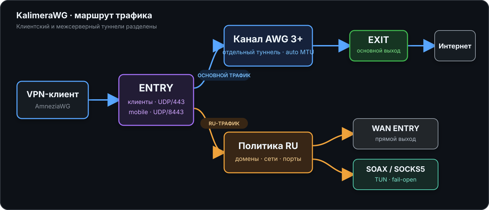
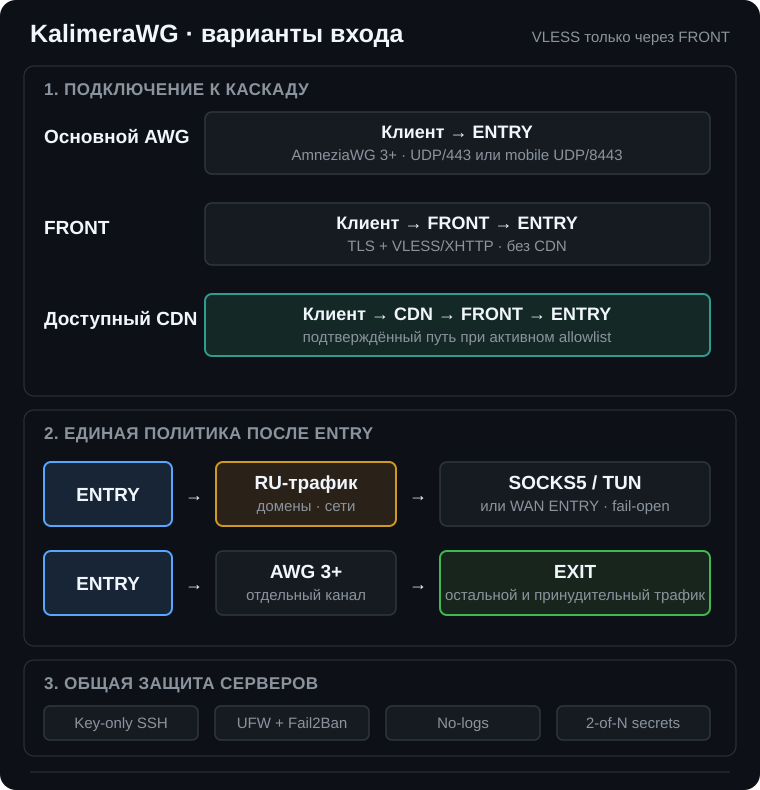

<p align="center">
  <a href="README.md"><b>Русский</b></a> ·
  <a href="README.en.md">English</a>
</p>

<p align="center">
  
</p>

<h1 align="center">KalimeraWG</h1>

<p align="center">
  <b>Собственный VPN-каскад на AmneziaWG 3.1 одной командой.</b><br>
  Вход в своей стране, выход за рубежом, российские сайты напрямую<br>
  и резервный вход через CDN на случай белых списков.
</p>

<p align="center">
  <a href="https://github.com/FujitaKinzoku/KalimeraWG/releases/latest"></a>
  <a href="https://github.com/FujitaKinzoku/KalimeraWG/actions"></a>
  
  
  
  <a href="LICENSE"></a>
</p>

<p align="center">
  <a href="#быстрый-старт">Быстрый старт</a> ·
  <a href="#возможности">Возможности</a> ·
  <a href="#как-это-работает">Как это работает</a> ·
  <a href="#повседневная-работа">Команды</a> ·
  <a href="#документация">Документация</a> ·
  <a href="CHANGELOG.md">Что нового</a>
</p>

---

KalimeraWG превращает две-три чистые VPS с Ubuntu 24.04 в готовый VPN-каскад.
Вы отвечаете на вопросы установщика, а через 20–40 минут получаете работающие
серверы, первого клиента и набор команд для повседневной работы. Править
конфиги, `iptables` и `systemd` вручную не нужно.

**Зачем каскад.** Клиент подключается к серверу ENTRY в своей стране: такое
соединение реже блокируют и оно быстрее. Дальше трафик уходит по отдельному
туннелю на зарубежный EXIT, и сайты видят адрес EXIT. Российские сайты при этом
открываются напрямую с ENTRY, как будто VPN выключен. Если AmneziaWG
заблокируют или включат режим белых списков, остаётся третий сервер, FRONT: к
нему можно подключиться по VLESS через российский облачный CDN.

## Возможности

- **Каскад ENTRY → EXIT.** Отдельный туннель AmneziaWG 3.1 между серверами на
  модуле ядра, со своими ключами и параметрами. Порт EXIT открыт только для
  адреса ENTRY.
- **Маскировка AmneziaWG 3.1.** Полный набор полей обфускации, а структура
  профиля генерируется заново для каждой установки.
- **Резервный вход через CDN.** FRONT принимает VLESS/XHTTP напрямую или через
  CDN и передаёт трафик на ENTRY по служебному REALITY-соединению. Клиент
  CDN-пути не видит адрес ENTRY. Проверено с Yandex Cloud CDN и VK Cloud CDN.
- **Маршрутизация по странам.** Российские сети и домены идут напрямую с ENTRY
  или через ваш SOCKS5 (например, SOAX), всё остальное уходит через EXIT.
  Если прокси отказал, трафик сам переключается на прямой маршрут.
- **DNS без утечек.** Клиенты используют локальный Unbound на ENTRY, наружу
  запросы уходят по DoT или DoH. Можно включить DNSSEC-рекурсию на EXIT внутри
  туннеля.
- **Профили для любых клиентов.** `performance`, `balanced`, `masking`,
  `mobile/AWG3+` для AmneziaWG 5 и совместимый профиль для KeeneticOS 4.3.
- **Автоматический MTU.** Установщик измеряет PMTU в обе стороны и сам
  согласует MTU всех сегментов, включая клиентские конфиги.
- **Секреты не лежат на диске открытым текстом.** Shamir 2-of-N и AES-256-GCM:
  открытые конфигурации живут только в RAM, службы получают их через systemd
  credentials. Украденный диск одного сервера ничего не раскрывает.
- **Без логов.** journald, Fail2Ban и учёт входов хранятся только в RAM. Логи
  UFW и DNS-запросов, история shell и coredump отключены.
- **Закрытый SSH.** Отдельный администратор `kalimera`, вход только по ключу,
  root закрыт, нестандартный порт и Fail2Ban.
- **Самоконтроль.** `awg-health` и `server-audit` проверяют службы, firewall,
  DNS и маршруты. Telegram сообщает о перезагрузках и сбоях.
- **Обновления под контролем.** Каждый сервер раз в сутки проверяет новое
  ядро, AmneziaWG и Xray-core и показывает `UPD` с командой, которая его
  применит. Обновление ставится одной командой, с проверкой и откатом.

### Чего KalimeraWG не делает

- Не обещает анонимность и не защищает от целевой слежки.
- Не гарантирует обход любой блокировки. Оператор может сменить политику в
  любой момент, а FRONT остаётся аварийным путём, а не универсальным решением.
- Не ставит веб-панель и не открывает лишних портов. Управление только по SSH.
- Не хранит журналы посещений и не кладёт клиентские конфиги в Git или CI.
- Не обновляет себя сам. Он сообщает о новых версиях, но ставит их только по
  вашей команде.

## Как это работает

<p align="center">
  <picture>
    <source media="(max-width: 600px)" srcset="assets/cascade-ru-mobile.svg">
    
  </picture>
</p>

| Путь | Транспорт | Когда используется |
|---|---|---|
| клиент → ENTRY | AmneziaWG 3.1, UDP/443; mobile/AWG3+ на UDP/8443 | основной путь, минимум накладных расходов |
| клиент → FRONT | TLS + VLESS/XHTTP, TCP/443 | AmneziaWG заблокирован по отпечатку UDP |
| клиент → CDN → FRONT | TLS + VLESS/XHTTP, TCP/443 | режим белых списков, когда доступен облачный CDN |
| FRONT → ENTRY | VLESS + REALITY | служебный хоп, скрывает ENTRY от клиента CDN-пути |
| ENTRY → EXIT | AmneziaWG 3.1 на модуле ядра | весь зарубежный трафик |
| ENTRY → RU | напрямую или через SOCKS5 | российские сети и домены |

### Режим белых списков

<p align="center">
  <picture>
    <source media="(max-width: 600px)" srcset="assets/whitelist-cascade-ru-mobile.svg">
    
  </picture>
</p>

Полевой тест подтвердил: при активном режиме белых списков новая сессия
устанавливается по цепочке **российский облачный CDN → FRONT → ENTRY**, а после
входа российский трафик по-прежнему идёт напрямую, остальной уходит через EXIT.
Результат относится к проверенным сетям, CDN и моменту проверки и не
гарантирует одинаковую работу у всех операторов.

Данные от клиента к серверу передаются в заголовках GET-запросов, без тела
запроса: с 30.09.2026 Yandex Cloud CDN отвечает `413` на GET с телом. Поэтому
отдача через CDN ограничена примерно 2,2 Мбит/с, скачивание не ограничено.
Подробности, настройки CDN и матрица отказов в
[docs/front-relay.md](docs/front-relay.md).

## Быстрый старт

### 1. Подготовьте серверы

| | Что нужно |
|---|---|
| **ENTRY** | VPS в своей стране с публичным IPv4. На нём запускается установщик |
| **EXIT** | зарубежная VPS с публичным IPv4 |
| **FRONT** | по желанию: VPS с публичным IPv4 и доменом, A-запись которого указывает на этот сервер |
| **Система** | чистая Ubuntu 24.04 LTS на всех серверах |
| **Доступ** | к EXIT и FRONT: SSH-вход **по паролю** под root или под пользователем с `sudo` |
| **Время** | 20–40 минут |

Установщик ставит свой ключ на EXIT и FRONT через вход по паролю, а в конце сам
закрывает и root, и пароли. На ENTRY пароль не нужен: установка идёт локально
от root.

<details>
<summary><b>У сервера только пользователь с ключом, без пароля (типично для облаков)</b></summary>

Временно разрешите root вход по паролю. Под своим пользователем выполните:

```bash
sudo passwd root
printf 'PermitRootLogin yes\nPasswordAuthentication yes\n' | sudo tee /etc/ssh/sshd_config.d/01-bootstrap.conf
sudo sshd -t && sudo systemctl restart ssh
```

Не закрывая сессию, проверьте вход `ssh root@IP` по паролю с другого
компьютера. После установки удалите временный файл:

```bash
sudo rm /etc/ssh/sshd_config.d/01-bootstrap.conf && sudo systemctl restart ssh
```

Настройки установщика к тому времени уже действуют и перекрывают этот файл.

</details>

### 2. Подготовьте CDN (только для FRONT через CDN)

1. A-запись домена источника, например `example.com`, указывает на FRONT.
2. CDN-ресурс: источник по HTTPS на этот домен, заголовок Host и SNI равны
   домену источника, кеширование выключено, разрешён метод GET.
3. Публичный домен CDN-ресурса, например `cdn.example.com`, указан в DNS по
   инструкции провайдера CDN.

### 3. Запустите установщик

На ENTRY от root (`sudo -i`, если вы вошли обычным пользователем):

```bash
curl -fsSL https://raw.githubusercontent.com/FujitaKinzoku/KalimeraWG/v3.2.1/install.sh | bash
```

Команда устанавливает закреплённый выпуск `v3.2.1`, а не текущее состояние
ветки `main`. Установщик спросит адреса и SSH-порты серверов, ваш публичный
SSH-ключ, режим маршрута для российского трафика, DNS, а также нужны ли SOCKS5,
Telegram и FRONT. Адреса EXIT и FRONT указывайте как IPv4, а не DNS-имена.
Закрытый ключ вводить нельзя.

<details>
<summary><b>Установка через Git с предварительным просмотром кода</b></summary>

```bash
apt-get -o DPkg::Lock::Timeout=600 update
apt-get -o DPkg::Lock::Timeout=600 install -y git
git clone --branch v3.2.1 --depth 1 \
  https://github.com/FujitaKinzoku/KalimeraWG.git /root/KalimeraWG
cd /root/KalimeraWG
./deploy
```

</details>

Если установка прервалась, продолжите её с того же места:

```bash
cd /root/KalimeraWG && ./deploy --resume
```

### 4. Подключитесь

В конце установщик покажет конфигурацию первого клиента и одноразовые пароли
учётных записей: сохраните их. Новые клиенты создаются одной командой на ENTRY,
первый VLESS-профиль выдаётся на FRONT:

```bash
vpn-user phone balanced
```

```bash
vless-user export initial
```

### 5. Проверьте

На каждом сервере:

```bash
awg-health --strict
server-audit
systemctl --failed --no-pager
```

Ожидаемый результат: `GOOD`, `Ошибок аудита: 0` и ни одного failed-модуля.

## Повседневная работа

После установки входите на серверы как `kalimera`. Команды проекта работают
без `sudo` и без пароля, а при входе каждый сервер показывает таблицу с
состоянием каскада. Полная справка: `kalimera-help`.

| Задача | Команды |
|---|---|
| Состояние | `kalimera-status`, `awg-health --strict`, `server-audit` |
| Полная проверка каскада (на ENTRY) | `cascade-check`: ENTRY, EXIT, FRONT, связи и DNS; итог OK / WARN / FAIL |
| Клиенты AmneziaWG | `vpn-user ИМЯ ПРОФИЛЬ`, `vpn-user list`, `vpn-user delete ИМЯ` |
| Клиенты VLESS (на FRONT) | `vless-user create ИМЯ cdn`, `list`, `export`, `delete`; профиль с резервным каскадом: `vless-user auto ИМЯ ФАЙЛ` |
| Маршруты доменов | `ru-domain add`, `se-domain add`, `entry-domain add` |
| Российский прокси | `ru-proxy`, `ru-proxy-set`, `ru-direct-ports` |
| DNS | `dns-status`, `dot-switch`, `doh-switch` |
| Безопасность | `fail2ban-client status sshd`, `f2b-reset`, `ssh-key-audit status`, `telegram-test` |
| Обслуживание | `maintenance`, `update-all`, `kalimera-deploy --resume` |
| Обновления | `kalimera-updates`, `kalimera-updates install kernel`, `kalimera-deploy --resume --update-amneziawg`, `--update-xray` |
| Замена FRONT | `kalimera-deploy --resume --replace-front`, затем `--commit-front-replacement` |

```bash
ru-domain add example.ru       # открывать напрямую с ENTRY
se-domain add example.com      # всегда через EXIT
entry-domain add example.org   # напрямую, минуя российский прокси
```

### Клиентские профили

| Профиль | Для чего | Интерфейс |
|---|---|---|
| `balanced` | рекомендуемый вариант для большинства устройств | `awg0`, UDP/443 |
| `performance` | минимум накладных расходов, максимум скорости | `awg0` |
| `masking` | максимальный набор параметров маскировки | `awg0` |
| `mobile/AWG3+` | полный профиль AWG 3.1 для AmneziaWG 5.0.1.5 и новее | `awg-mobile`, UDP/8443 |
| `old` | KeeneticOS 4.3.x | `awg-old` |

## Безопасность

| Область | Как защищено |
|---|---|
| Секреты | Ansible Vault, `no_log`, права `0600`; на серверах Shamir 2-of-N и AES-256-GCM, открытые данные только в `/run` |
| Загрузка | службы ждут кворума долей и проверяют закреплённые SSH host keys; изменённый пакет секретов не запускается |
| SSH | `kalimera` по ключу, root закрыт, проверка нового доступа до закрытия старого порта |
| Привилегии | команды проекта через ограниченный список; полный `sudo` требует пароль |
| Firewall | UFW с запретом по умолчанию; межсерверный порт открыт только между ENTRY и EXIT |
| Обновления | проверка кандидатов, фиксация версий и автоматический откат |
| Репозиторий | Gitleaks, собственный поиск секретов, проверки YAML, Ansible, Shell и Python в CI |

Модель угроз и правила сообщения об уязвимостях: [SECURITY.md](SECURITY.md),
[docs/security-boundary.md](docs/security-boundary.md) и
[docs/RUNTIME-SECRETS.md](docs/RUNTIME-SECRETS.md).

## Проверенная совместимость

| Контур | Что проверено |
|---|---|
| Ubuntu 24.04 LTS | чистая установка ENTRY + EXIT + FRONT на реальных VPS, перезагрузка, строгий аудит |
| ENTRY–EXIT | handshake AWG 3.1 на модуле ядра, согласованный MTU, восстановление после перезагрузки |
| mobile/AWG3+ | полный профиль AWG 3.1, реальные подключения клиентов |
| KeeneticOS | профили `balanced` и `old` |
| Российский SOCKS5 | TCP/UDP, watchdog, автоматический переход на прямой маршрут и восстановление |
| Yandex Cloud CDN | передача данных в заголовках на Xray v26.7.28, живые пробы через CDN |
| VK Cloud CDN | чистая установка и рабочие VLESS-подключения через CDN |
| Xray-core v26.10.31 | пара клиент + сервер на реальных бинарниках: клиенты 26.7.28 и 26.10.31 работают без перевыпуска профилей |
| Белые списки | новая сессия через российский облачный CDN → FRONT → ENTRY |

Матрица фиксирует реально пройденные сценарии и не гарантирует одинаковое
поведение у всех операторов, хостингов и версий клиентов.

## Обновление

### Система

Каждую ночь в 05:20 сервер сам ставит все обновления Ubuntu и новое ядро той
же сборки, на ENTRY и EXIT сразу собирая под него модуль AmneziaWG. AmneziaWG,
sing-box и Xray при этом не трогаются. Перезагрузка не выполняется: когда
новое ядро установлено, появляется `UPD` «ядро … установлено, работает …».
Перезагружайте серверы одного каскада по очереди, следующий - после
`awg-health --strict` на предыдущем. То же самое вручную и сразу: `update-all`.
Только обновления безопасности, как до v3.0.11:
`awg_maintenance_upgrade_mode: security` в inventory.

### Компоненты

Каждый сервер раз в сутки проверяет, не вышло ли новое ядро, AmneziaWG или
Xray-core. Это уведомление, а не ошибка: в `server-audit` и на экране входа
появляется строка вида

```
UPD  доступен Xray 26.11.9, работает 26.10.31
     → на ENTRY: kalimera-deploy --resume --update-xray (с проверкой через CDN и откатом)
```

Проверить заново и показать полный список на сервере (без sudo): `kalimera-updates`.

| Что | Команда | Что происходит |
|---|---|---|
| ядро | ставится ночью само, или сразу: `kalimera-updates install kernel`; затем `sudo reboot` | ставит новое ядро и собирает под него модуль AmneziaWG; серверы одного каскада перезагружайте по очереди |
| AmneziaWG | на ENTRY: `kalimera-deploy --resume --update-amneziawg` | обновляет пакеты на ENTRY и EXIT, проверяет каскад, при ошибке откатывает; клиентские конфиги не меняются |
| Xray-core | на ENTRY: `kalimera-deploy --resume --update-xray` | ставит на FRONT последний стабильный выпуск с SHA-256 из GitHub, проверяет аплинк через CDN, при ошибке откатывает |

### Выпуск KalimeraWG

Повторно применить текущий выпуск:

```bash
kalimera-deploy --resume
```

Перейти на новый выпуск:

```bash
sudo git -C /root/KalimeraWG fetch origin --tags
sudo git -C /root/KalimeraWG switch --detach v3.2.1
kalimera-deploy --resume
```

Перед обновлением прочитайте release notes: в некоторых выпусках нужно заново
выдать клиентские профили.

## Документация

| Документ | О чём |
|---|---|
| [docs/interactive-deploy.md](docs/interactive-deploy.md) | этапы установки и ответы установщику |
| [docs/front-relay.md](docs/front-relay.md) | FRONT, CDN и режим белых списков |
| [docs/awg3.md](docs/awg3.md) | межсерверный AWG 3.1 и его параметры |
| [docs/security-boundary.md](docs/security-boundary.md) | секреты, firewall и границы доверия |
| [docs/terminal.md](docs/terminal.md) | интерфейс терминала и справка |
| [docs/acceptance.md](docs/acceptance.md) | приёмочная проверка |
| [docs/upstream.md](docs/upstream.md) | закреплённые версии сторонних компонентов |
| [CHANGELOG.md](CHANGELOG.md) | история выпусков |

## Что нового

**v3.0** перевела межсерверный канал и mobile на модуль ядра с полным
AmneziaWG 3.1 (потери на канале 0,85% вместо 6–8%), добавила роль FRONT с
резервным входом через CDN и сделала структуру профилей случайной для каждой
установки.

- **v3.2.1:** адрес ENTRY для отчёта cascade-check определяется деплоем сам:
  EXIT и FRONT видят его в сессии деплоя или в TCP-соединении (работает и за
  NAT), поэтому ручная переменная `cascade_check_entry_source_ipv4` не нужна.
- **v3.2.0:** `cascade-check` на ENTRY проверяет весь каскад одной командой:
  связи и задержки, CDN, DNS, EXIT и FRONT, с итогом OK / WARN / FAIL.
  Откат обновления AmneziaWG не зависит от PPA и от очистки кэша apt.
- **v3.1.1:** VLESS разрешает российские имена на ENTRY по той же
  DNS-политике, что AmneziaWG (российский DoH через dnsmasq), а не через
  зарубежный Unbound.
- **v3.1.0:** один VLESS-профиль на несколько каскадов (до шести) с
  переключением на следующий только при потере связи (`vless-user auto`);
  собственные имена маскировки XHTTP для каждой установки, на существующем
  FRONT - `--rotate-front-disguise`; цветные отчёты `awg-health`,
  `server-audit` и `kalimera-updates` с итогом и рекомендациями;
  исправлена потеря маршрута через EXIT после ночного обслуживания.
- **v3.0.11:** ночное обслуживание ставит все обновления Ubuntu и новое
  ядро (перезагрузка вручную); явная изоляция клиентов одной зоны на ENTRY
  с проверкой в `awg-health`; предложение перейти на Ubuntu 26.04 скрыто.
- **v3.0.10:** `server-audit` на ENTRY не принимает исходящие UDP-сокеты
  sing-box за посторонних слушателей.
- **v3.0.9:** `kalimera-updates` на ENTRY и EXIT больше не завершается с
  кодом 141; команда без sudo сама обновляет списки пакетов, проверяет и
  показывает обновления, а недоступные репозитории называет строкой `INFO`.
- **v3.0.8:** обычный `kalimera-deploy --resume` не обращается к
  `keyserver.ubuntu.com`, если правильный ключ PPA AmneziaWG уже установлен.
- **v3.0.7:** обычный `kalimera-deploy --resume` не останавливается,
  когда недоступен Launchpad с PPA AmneziaWG; обновление пакетов без него
  не начинается и сообщает причину.
- **v3.0.6:** Xray-core v26.10.31 на FRONT; ежедневная проверка новых версий
  ядра, AmneziaWG и Xray с уведомлением `UPD` и команды их установки.
- **v3.0.5:** `server-audit` не принимает короткоживущие исходящие сокеты
  за посторонних слушателей и показывает порт настоящего.
- **v3.0.4:** установка больше не останавливается на первом этапе с ошибкой
  «Permission denied (publickey)» для root.
- **v3.0.3:** согласованный MTU клиентского конфига сохраняется сам.
- **v3.0.2:** отключён таймер `fwupd-refresh`, который ежедневно падал на VPS.
- **v3.0.1:** на mobile/AWG3+ выключена рандомизация размера пакетов, из-за
  которой профиль терял около 5% пакетов.

Полная история в [CHANGELOG.md](CHANGELOG.md).

## Ответственное использование

KalimeraWG не гарантирует анонимность, репутацию IP-адресов, доступность
внешнего прокси или отсутствие блокировок. После выхода из VPN незашифрованный
протокол остаётся незашифрованным. Вы отвечаете за законность использования и
соблюдение правил хостинга, прокси-провайдера и сетей, к которым подключаетесь.

KalimeraWG не является официальным проектом Amnezia VPN. Сторонние компоненты и
их лицензии перечислены в [THIRD_PARTY_NOTICES.md](THIRD_PARTY_NOTICES.md).
Проект распространяется по лицензии [MIT](LICENSE).
